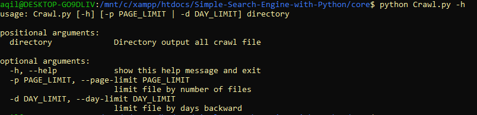
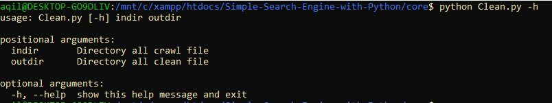
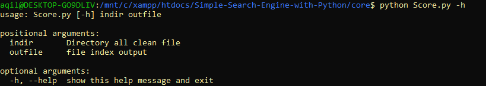
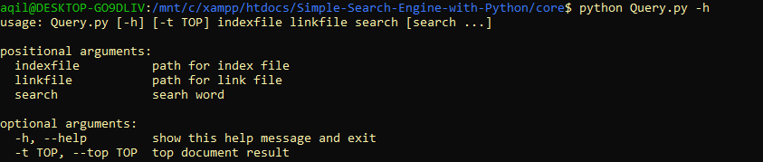
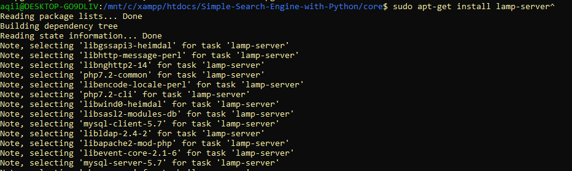

# Simple-Search-Engine-with-Python

### Run Program

- `cd Simple-Search-Engine-with-Python/core`
- Crawling first with file Crawl.py
  
- Cleaning file Crawl with Clean.py
  
- Scoring all term and doc with Score.py
  
- Test search with Query.py
  

- Start apache server lamp-server^
### Requirement

- python
- package -> `pip install -r requirements.txt`
- lamp-server^ -> `sudo apt-get lamp-server^`
  